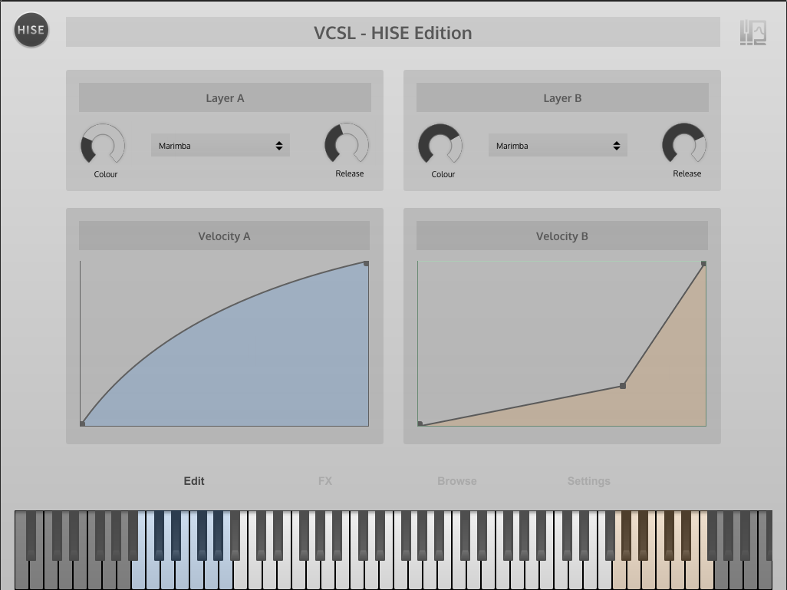

# Versillian Community Sample Library - HISE Edition

This is the repository of the HISE project presented on the ADC2018 in London.

It uses a few samples from the [open source sample library from Versillian Studios](https://github.com/sgossner/VCSL) and wraps it in a plugin to demonstrate a few features:

- sample editing / sample map loading
- connecting parameters to UI elements
- custom UI elements
- page swap logic
- adding floating tiles
- user preset

This project is used as working example for my presentation at the ADC2018 (the youtube link to the recorded talk will be posted here when available).

## C++ Project

In addition to the "standard" HISE project, this project is also rewritten entirely in C++. In order to compile this version, just set the **UseRawFrontend** flag in the Project settings and recompile the project.

The C++ code is located in the `AdditionalSourceCode` directory.